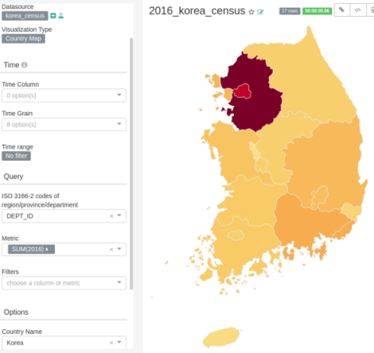

## Superset Countrymap Chart에 한국 지도 데이터 추가하기

superset 문서에서 설명하는 방식을 바탕으로 작업했다.

- 작업 순서 : https://superset.incubator.apache.org/visualization.html#need-to-add-a-new-country

### 기존 데이터 위치 및 형태 확인

공식문서와 달리(버전 업그레이드 문제) Chart 관련 데이터는 apache-superset/superset-ui-plugins에서 따로 관리되고 있었다.

CountryMap 관련 github : [@superset-ui/legacy-plugin-chart-country-map](https://github.com/apache-superset/superset-ui-plugins/tree/master/packages/superset-ui-legacy-plugin-chart-country-map)

### geojson 데이터 생성

원본 shp데이터에 지역마다 ISO 고유 코드를 부여한 뒤 geojson으로 변환했다.
( geojson 변환은 공식 문서에 나온 온라인 사이트로 처리 )

geopandas 활용 코드: [create_map.py](./create_map.py)

**PR** : [feat: add Korea(South) to Country Maps #230](https://github.com/apache-superset/superset-ui-plugins/pull/230)

참고 : 

- 원본데이터 출처 : https://www.diva-gis.org/gdata (ISO 3166-2)

- 한국 ISO 코드 https://ko.wikipedia.org/wiki/ISO_3166-2:KR

### dropdown 메뉴에 Korea 추가 요청

apache/incubator-superset에 ui-plugin 업데이트와 함께 Korea 추가 요청

**PR** : [feat: add korea(South) info to CountryMap viz  #8478](https://github.com/apache/incubator-superset/pull/8478)

### 예시

